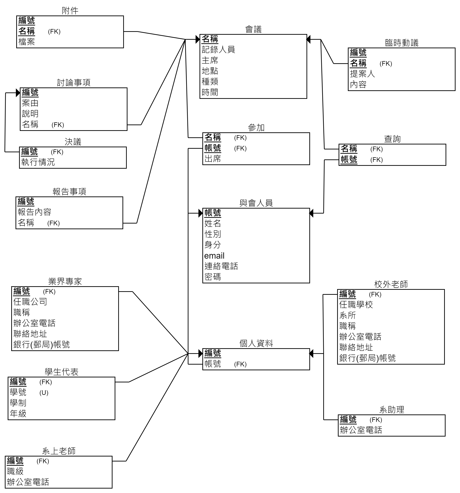

## 高雄大學資訊工程學系會議管理系統

### 組員
謝佾遑、吳修維、林聖曜、曾彥輔

### 注意事項
- 先去看requirements.txt，把裡面的東西裝完
- 網站內部和EER Model長不一樣(之後再看要不要把EER改成網站的樣子)
- 當天有要做改動的一定要先講，做之前先git pull把東西抓下來

### 更新事項
- 2021/11/19
    1. 新增會議、人員模型
    2. 新增基底網頁和導覽列
    3. 新增頁面url
    4. 新增黑暗模式與淺色模式的css
- 2021/11/20
    1. 新增帳號申請表單
    2. 新增註冊、登入、登出
    3. 將function based view改為class based view
- 2021/11/21
    1. 修改登入後的導覽列顯示
    2. 新增自訂的登入表單及登出重新導向
    3. 人員的個人資料(完成度30%)
- 2021/11/24
    1. 重新調整架構
    2. 加入自定義的User：Participant
    3. 原本的Participant改為Profile
- 2021/11/26
    1. 完成與會人員的功能
    2. 完成動態簡介的功能
    3. 個人簡介的html未完成(目前只單純套樣板)
- 2021/11/27
    1. 完成人員所有的html(基本部分，外觀可以美化)
    2. 加入權限限制和群組
- 2021/11/28
    1. 完成會議基本架構和限制
    2. 新增日曆
    3. 調整網頁外觀
    4. 新增message功能(未完成)
    5. 修正了管理員修改簡介後會出現姓名顯是錯誤的問題
    6. 將註冊帳號的view改為function based view
- 2021/12/3
    1. 將登入方式改為使用email和密碼(原本為使用者名稱和密碼)
    2. 修改admin後台的表單
    3. 調整app架構
    4. 調整template邏輯(下次可能會將template改成jinja2來增加效能)
- 2021/12/5
    1. 新增會議對與會人員的多對多關係
    2. 解決新增的會議時間會自動跳到午夜(將欄位改成DatetimeField就好)
    3. 待解決問題(從日曆的超連結前往會議時，某些會往前跳一天)
- 2021/12/7
    1. 解決日曆內超連結時間亂掉的原因(因為django儲存的是UTC，所以需要加上8小時轉成台北時間)
- 2021/12/9
    1. 嘗試取消簡介設定，直接將人員分類，看看效果如何
- 2021/12/11
    1. 重新調整內部架構(取消簡介，以個人資料來替代，避免空值問題)
    2. 去除不必要的重複邏輯(整合成function)
    3. 重新調整ER Model和Relation Model
    4. 將登入和登出的view繼承給自定義的class，方便之後修改
    5. 調整表格及標題的css
    6. 將網頁字體改為思源黑體
    7. alert不會在適當時機出現(待修正)

### Model
1. 會議
2. 與會人員(包含子類別)
3. 臨時動議
4. 報告事項
5. 討論事項
6. 決議
7. 附件

### 基本功能
1. 與會人員可以參加會議
2. 與會人員可以查詢、觀看自己的會議紀錄
3. 與會人員可以提出修改會議的請求
4. 會議可以附加附件
5. 與會人員可以提出臨時動議
6. 追蹤決議執行結果

### 額外功能
- [ ] 開會時寄信給與會人員
- [ ] 引導用的聊天機器人
- [ ] 黑暗模式(也許會當成預設主題)
- [ ] 網頁顯示目前正在進行的會議
- [ ] 響應式網頁
- [ ] 已結束的會議會顯示在首頁

### EER Model

### Relation Model

### 工作表
謝佾遑、曾彥輔：
- [ ] 會議功能(新增、更新、通知)
- [x] 人員功能(新增、查詢、更新)
- [ ] 記錄功能(新增、查詢、更新)
- [ ] 臨時動議(新增、刪除、更新)
  
吳修維、林聖曜
- [ ] 附件功能(新增、刪除、更新)
- [ ] 決議功能(新增、刪除、更新)
- [ ] 美化網頁及小功能

### 參考資料
1. https://sweetrans.pixnet.net/blog/post/289207848-%E3%80%88%E8%AB%87%E6%96%87%E8%AB%96%E8%AD%AF%E3%80%89%E6%9C%83%E8%AD%B0%E7%9A%84%E8%8B%B1%E6%96%87-english-for-meetings-%E8%98%87
2. https://www.huiwenteo.com/normal/2018/07/24/django-calendar.html