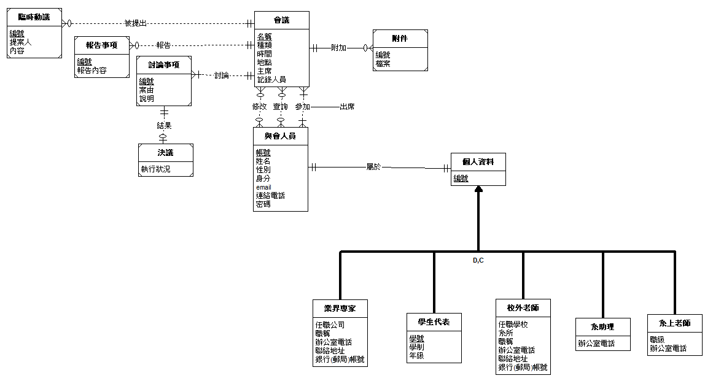

## 高雄大學資訊工程學系會議管理系統

### 組員
謝佾遑、吳修維、林聖曜、曾彥輔

### 更新事項
- 2021/11/19 
    1. 新增會議、人員模型
    2. 新增基底網頁和導覽列
    3. 新增頁面url
    4. 新增黑暗模式與淺色模式的css
- 2021/11/20
    1. 新增帳號申請表單
    2. 新增註冊、登入、登出
    3. 將function based view改為class based view
- 2021/11/21
    1. 修改登入後的導覽列顯示
    2. 新增自訂的登入表單及登出重新導向

### Model
1. 會議
2. 與會人員(包含子類別)
3. 臨時動議
4. 報告事項
5. 討論事項
6. 決議
7. 附件

### 基本功能
1. 與會人員可以參加會議
2. 與會人員可以查詢、觀看自己的會議紀錄
3. 與會人員可以提出修改會議的請求
4. 會議可以附加附件
5. 與會人員可以提出臨時動議
6. 追蹤決議執行結果

### 額外功能
- [ ] 開會時寄信給與會人員
- [ ] 引導用的聊天機器人
- [ ] 黑暗模式(也許會當成預設主題)
- [ ] 網頁顯示目前正在進行的會議
- [ ] 響應式網頁
- [ ] 已結束的會議會顯示在首頁

### EER Model

### 工作表
謝佾遑、曾彥輔：
- [ ] 會議功能(新增、刪除、更新、通知)
- [ ] 人員功能(新增、查詢、更新)
- [ ] 記錄功能(新增、查詢、更新)
- [ ] 臨時動議(新增、刪除、更新)
  
吳修維、林聖曜
- [ ] 附件功能(新增、刪除、更新)
- [ ] 決議功能(新增、刪除、更新)
- [ ] 美化網頁及小功能